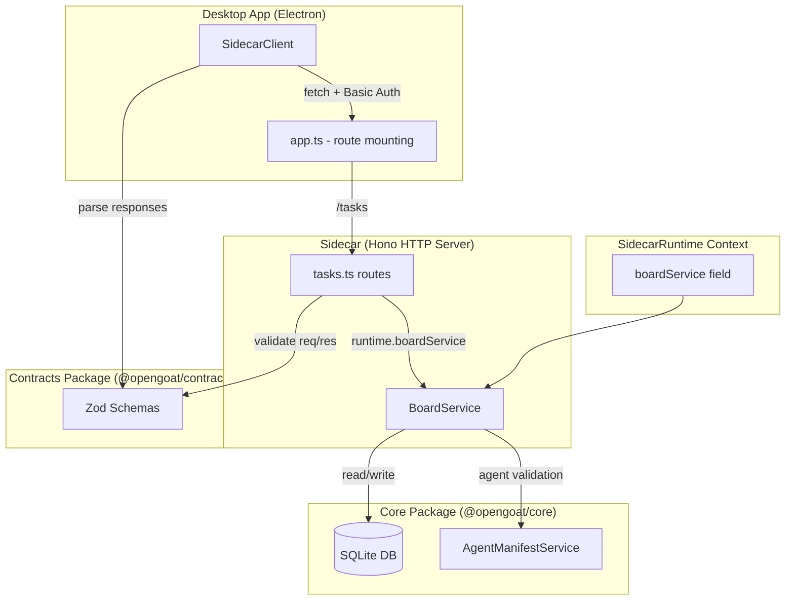

## Overview

Wire the existing `BoardService` from `@opengoat/core` into the sidecar HTTP API and add corresponding client methods to the desktop `SidecarClient`. This is the data foundation that all Board UI features depend on. The `BoardService` already has full task CRUD, status updates, blockers, artifacts, and worklog — but none of it is currently accessible from the desktop app because no HTTP routes or client methods exist.

## Acceptance criteria

- [ ] `BoardService` is instantiated and available in `SidecarRuntime` context
- [ ] Sidecar exposes a task route group with these endpoints:
  - `GET /tasks` — list tasks for the active project (supports query params: `status`, `assignee`, `limit`, `offset`)
  - `GET /tasks/:taskId` — get a single task with full detail (blockers, artifacts, worklog)
  - `PATCH /tasks/:taskId/status` — update task status (body: `{ status, reason? }`)
  - `POST /tasks/:taskId/blockers` — add a blocker (body: `{ content }`)
  - `POST /tasks/:taskId/artifacts` — add an artifact (body: `{ content }`)
  - `POST /tasks/:taskId/worklog` — add a worklog entry (body: `{ content }`)
  - `DELETE /tasks` — delete tasks (body: `{ taskIds }`)
- [ ] `SidecarClient` in `apps/desktop/src/lib/sidecar/client.ts` has new async methods matching each endpoint: `listTasks()`, `getTask()`, `updateTaskStatus()`, `addTaskBlocker()`, `addTaskArtifact()`, `addTaskWorklog()`, `deleteTasks()`
- [ ] All endpoints return JSON matching the existing `TaskRecord` shape from `packages/core/src/core/boards/domain/board.ts`
- [ ] Endpoints use the active agent's paths for scoping (consistent with existing sidecar route pattern)

## Notes

- Follow the existing sidecar route patterns in `packages/sidecar/src/server/routes/` (Hono framework, basic auth middleware)
- The `BoardService` methods already exist at `packages/core/src/core/boards/application/board.service.ts` — just wire them in
- `listLatestTasksPage()` supports pagination with `limit`/`offset` and filtering by `status`, `assignee`, `owner` — use this for the list endpoint
- The `SidecarRuntime` context interface is at `packages/sidecar/src/server/context.ts` — add `boardService` there
- Keep the route file focused and small (~150 lines); follow the pattern of existing route files like agent routes or chat routes
- Task creation is NOT needed as an HTTP endpoint for MVP — tasks are created by skills/agents through the core service during chat, not directly by the UI

## Research Notes

### Existing BoardService API (packages/core/src/core/boards/application/board.service.ts)

The `BoardService` class is fully implemented with SQLite persistence. Key methods needed for this task:

| Method | Signature | Notes |
|--------|-----------|-------|
| `listLatestTasksPage()` | `(paths, { assignee?, owner?, status?, limit?, offset? })` → `{ tasks, total, limit, offset }` | Paginated list with filtering — use for `GET /tasks` |
| `getTask()` | `(paths, taskId)` → `TaskRecord` | Single task with hydrated blockers/artifacts/worklog |
| `updateTaskStatus()` | `(paths, actorId, taskId, status, reason?)` → `TaskRecord` | Status + optional reason |
| `addTaskBlocker()` | `(paths, actorId, taskId, blocker)` → `TaskRecord` | Appends blocker entry |
| `addTaskArtifact()` | `(paths, actorId, taskId, content)` → `TaskRecord` | Appends artifact entry |
| `addTaskWorklog()` | `(paths, actorId, taskId, content)` → `TaskRecord` | Appends worklog entry |
| `deleteTasks()` | `(paths, actorId, taskIds)` → `{ deletedTaskIds, deletedCount }` | Bulk delete |

All methods require `OpenGoatPaths` (available as `runtime.opengoatPaths`) and mutation methods require `actorId` for permission checks. The `actorId` can default to the sidecar's active agent or be passed as a header/param.

### TaskRecord Domain Shape (packages/core/src/core/boards/domain/board.ts)

```typescript
interface TaskRecord {
  taskId: string;
  createdAt: string;
  updatedAt: string;
  owner: string;
  assignedTo: string;
  title: string;
  description: string;
  status: string;          // "todo" | "doing" | "pending" | "blocked" | "done"
  statusReason?: string;
  blockers: string[];
  artifacts: TaskEntry[];  // { createdAt, createdBy, content }
  worklog: TaskEntry[];    // { createdAt, createdBy, content }
}
```

### SidecarRuntime Context (packages/sidecar/src/server/context.ts)

Currently has 8 fields. `boardService` must be added as a new field of type `BoardService`. The `BoardService` is already instantiated inside `OpenGoatService` — but the sidecar needs its own instance since the sidecar runtime is separate from `OpenGoatService`.

### Sidecar Route Patterns (packages/sidecar/src/server/routes/)

Four existing route files follow a consistent pattern:
- Factory function: `createXRoutes(runtime: SidecarRuntime): Hono`
- New `Hono()` instance with route handlers
- Services accessed via `runtime` closure
- Input validation with Zod schemas from `@opengoat/contracts`
- Output validation with Zod schemas before `context.json()`
- Global basic auth middleware in `app.ts` — no per-route auth needed
- Route mounting: `app.route("/tasks", createTaskRoutes(runtime))` in `app.ts`

### SidecarClient Patterns (apps/desktop/src/lib/sidecar/client.ts)

- Uses native `fetch()` with Basic Auth headers
- Private `request(path, init?)` method handles auth, content-type, error checking, JSON parsing
- All public methods: call `this.request()` → parse with Zod schema → return typed result
- Path params encoded with `encodeURIComponent()`
- Query params built with `URLSearchParams`
- POST/PATCH/DELETE pass `{ method, body: JSON.stringify(...) }`

### Contracts Package

No existing task/board Zod schemas in `@opengoat/contracts`. New schemas will need to be created for:
- `taskRecordSchema` / `taskEntrySchema` — response validation
- `taskListPageSchema` — paginated response
- Request body schemas for status update, blocker, artifact, worklog, delete

## Assumptions

1. **Actor ID**: Mutation endpoints will accept an `actorId` via a request header or default to a well-known agent ID. The existing agent routes use `context.req.param("agentId")` — task routes should follow a similar pattern, likely using a query param or header for the acting agent since tasks are not agent-scoped in the URL.
2. **No task creation endpoint**: As stated in notes — tasks are created by skills/agents through the core service during chat flows, not directly from the UI.
3. **BoardService instantiation**: The sidecar will create its own `BoardService` instance using the same deps pattern as `OpenGoatService` does (needs `FileSystemPort`, `PathPort`, `nowIso`, `AgentManifestService`). These deps are either already available or easily constructable in the sidecar bootstrap.
4. **Zod schemas**: New contract schemas will be added to `@opengoat/contracts` following the existing pattern (one schema per request/response shape, exported from `index.ts`).

## Architecture Diagram



## One-Week Decision

**YES** — this task is completable in well under one week.

**Rationale:**
- The `BoardService` is fully implemented — no new business logic needed
- The sidecar route pattern is well-established with 4 existing examples to follow
- The `SidecarClient` pattern is mechanical (one method per endpoint, same fetch+Zod pattern)
- The Zod schemas are straightforward mirrors of existing TypeScript interfaces
- Total new code is ~150 lines for routes, ~80 lines for client methods, ~60 lines for schemas, ~30 lines for context/bootstrap changes — roughly 320 lines across 4-5 files
- No complex integrations, no new dependencies, no architectural decisions to make
- Existing test patterns (`*.test.ts` files exist for all route modules) make test writing straightforward

## Implementation Plan

### Phase 1: Contracts — Add Zod schemas (~60 lines)

**Files:**
- `packages/contracts/src/boards.ts` (new) — task-related Zod schemas

**Work:**
- Create `taskEntrySchema` matching `TaskEntry` interface
- Create `taskRecordSchema` matching `TaskRecord` interface
- Create `taskListPageSchema` for paginated response (`{ tasks, total, limit, offset }`)
- Create request body schemas: `updateTaskStatusRequestSchema`, `addTaskBlockerRequestSchema`, `addTaskArtifactRequestSchema`, `addTaskWorklogRequestSchema`, `deleteTasksRequestSchema`
- Export all schemas from `packages/contracts/src/index.ts`

### Phase 2: Runtime — Add BoardService to SidecarRuntime (~30 lines)

**Files:**
- `packages/sidecar/src/server/context.ts` — add `boardService: BoardService` to `SidecarRuntime` interface
- Sidecar bootstrap file (where `SidecarRuntime` is constructed) — instantiate `BoardService` with required deps and add to runtime object

**Work:**
- Import `BoardService` from `@opengoat/core`
- Add `boardService` field to `SidecarRuntime` interface
- Instantiate `BoardService` in the bootstrap code with `{ fileSystem, pathPort, nowIso, agentManifestService }` deps (mirror the pattern from `OpenGoatService` constructor)

### Phase 3: Routes — Create task route file (~150 lines)

**Files:**
- `packages/sidecar/src/server/routes/tasks.ts` (new) — task HTTP endpoints

**Work:**
- Create `createTaskRoutes(runtime: SidecarRuntime): Hono` factory
- Implement 7 route handlers:
  - `GET /` → `runtime.boardService.listLatestTasksPage(runtime.opengoatPaths, { status, assignee, limit, offset })` — parse query params, return paginated result
  - `GET /:taskId` → `runtime.boardService.getTask(runtime.opengoatPaths, taskId)` — return single task
  - `PATCH /:taskId/status` → `runtime.boardService.updateTaskStatus(runtime.opengoatPaths, actorId, taskId, status, reason)` — validate body, return updated task
  - `POST /:taskId/blockers` → `runtime.boardService.addTaskBlocker(runtime.opengoatPaths, actorId, taskId, content)` — validate body, return updated task
  - `POST /:taskId/artifacts` → `runtime.boardService.addTaskArtifact(runtime.opengoatPaths, actorId, taskId, content)` — validate body, return updated task
  - `POST /:taskId/worklog` → `runtime.boardService.addTaskWorklog(runtime.opengoatPaths, actorId, taskId, content)` — validate body, return updated task
  - `DELETE /` → `runtime.boardService.deleteTasks(runtime.opengoatPaths, actorId, taskIds)` — validate body, return deletion result
- Register in `app.ts`: `app.route("/tasks", createTaskRoutes(runtime))`
- Validate all inputs with Zod request schemas, all outputs with Zod response schemas

### Phase 4: Client — Add SidecarClient methods (~80 lines)

**Files:**
- `apps/desktop/src/lib/sidecar/client.ts` — add 7 new async methods

**Work:**
- `listTasks(params?)` — `GET /tasks?status=...&assignee=...&limit=...&offset=...` → parse with `taskListPageSchema`
- `getTask(taskId)` — `GET /tasks/:taskId` → parse with `taskRecordSchema`
- `updateTaskStatus(taskId, status, reason?)` — `PATCH /tasks/:taskId/status` → parse with `taskRecordSchema`
- `addTaskBlocker(taskId, content)` — `POST /tasks/:taskId/blockers` → parse with `taskRecordSchema`
- `addTaskArtifact(taskId, content)` — `POST /tasks/:taskId/artifacts` → parse with `taskRecordSchema`
- `addTaskWorklog(taskId, content)` — `POST /tasks/:taskId/worklog` → parse with `taskRecordSchema`
- `deleteTasks(taskIds)` — `DELETE /tasks` → parse with `deleteTasksResponseSchema`

### Phase 5: Tests (~100 lines)

**Files:**
- `packages/sidecar/src/server/routes/tasks.test.ts` (new) — route tests

**Work:**
- Follow existing test patterns from `auth.test.ts` / `agents.test.ts`
- Test each endpoint: success path, 404 for missing task, validation errors
- Verify Zod schema compliance on responses

## Handoff

### What was done
- Added 10 Zod schemas (request + response) for board/task contracts to `@opengoat/contracts`
- Added `boardService` to `SidecarRuntime` interface and instantiated `BoardService` with its deps (`FileSystemPort`, `PathPort`, `nowIso`, `AgentManifestService`) in the sidecar bootstrap
- Created task route file with 7 endpoints: `GET /tasks`, `GET /tasks/:taskId`, `PATCH /tasks/:taskId/status`, `POST /tasks/:taskId/blockers`, `POST /tasks/:taskId/artifacts`, `POST /tasks/:taskId/worklog`, `DELETE /tasks` — registered at `/tasks` in `app.ts`
- Added 7 new async methods to `SidecarClient`: `listTasks()`, `getTask()`, `updateTaskStatus()`, `addTaskBlocker()`, `addTaskArtifact()`, `addTaskWorklog()`, `deleteTasks()`
- Actor ID for mutation endpoints is read from `x-actor-id` header, defaulting to `"sidecar"`

### Tests written
- `packages/sidecar/src/server/routes/tasks.test.ts` — 12 unit tests covering: list tasks (with and without query params), get task (success + 404), update status (basic, with reason, actor-id header), add blocker, add artifact, add worklog, delete tasks (basic + actor-id header)

### Deviations from plan
- Schemas were added directly to `packages/contracts/src/index.ts` instead of a separate `boards.ts` file — follows the existing pattern where all schemas live in a single index file
- Actor ID uses `x-actor-id` request header rather than a query param — cleaner for mutation endpoints and avoids polluting the URL

### Concerns
None

### Files changed
- `packages/contracts/src/index.ts` — added task/board Zod schemas and types
- `packages/sidecar/src/server/context.ts` — added `boardService` to `SidecarRuntime`
- `packages/sidecar/src/index.ts` — instantiate `BoardService` and wire into runtime
- `packages/sidecar/src/server/routes/tasks.ts` — new task route file
- `packages/sidecar/src/server/app.ts` — register task routes
- `apps/desktop/src/lib/sidecar/client.ts` — 7 new client methods
- `packages/sidecar/src/server/routes/tasks.test.ts` — 12 route tests
