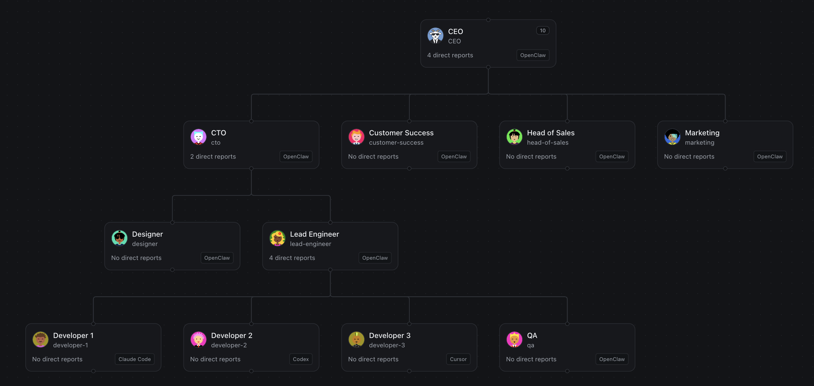

# OpenGoat

**Build AI Autonomous Organizations of OpenClaw Agents.**

[](https://opengoat.ai)

[](https://www.npmjs.com/package/opengoat)
[](https://github.com/marian2js/opengoat/actions)

[](LICENSE)

OpenGoat is a platform for creating hierarchical organizations of AI agents that collaborate to achieve complex goals. Powered by OpenClaw, it enables scalable delegation, task management, and efficient AI-driven workflows.

## Features

- **Agent Hierarchy Management**: Organize AI agents in reporting structures for scalable delegation.
- **Task Assignment and Tracking**: Create, assign, and monitor tasks with status updates, blockers, and artifacts.
- **Persistent Memory**: Agents retain long-term memory for continuity across sessions.
- **Tool and Skill Integration**: Access external tools and APIs seamlessly.
- **Collaboration Tools**: Enable messaging and coordination between agents.

For more details, see our [Initial Product Roadmap](docs/product-roadmap.md) (coming soon).

## Installation

```bash
# Install OpenClaw and OpenGoat
npm i -g openclaw opengoat

# Setup OpenClaw
openclaw onboard

# Start OpenGoat
opengoat start
```

Open `http://127.0.0.1:19123` to access the UI, add a project, and interact with the CEO agent.

### Docker

```bash
docker build -t opengoat:latest .
docker run --rm -p 19123:19123 -v opengoat-data:/data/opengoat opengoat:latest
```

See [Docker documentation](docs/docker.md) for more.

## Quick Start

```bash
opengoat init
opengoat agent --message \"Set up a CTO and two engineers for this project.\"
```

Run the UI server:

```bash
opengoat start
```

## Documentation

- [Organization Runtime](docs/organization-runtime.md)
- [Docker Setup](docs/docker.md)
- [ACP Integration](docs/acp.md)

## Contributing

We welcome contributions! Please see [CONTRIBUTING.md](CONTRIBUTING.md) for guidelines.

## License

[MIT](LICENSE)
